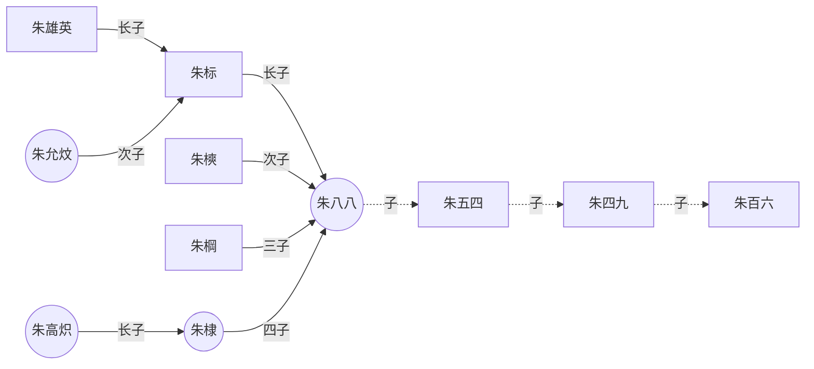

[skills/abc.md](skills/abc.md)


```shell
cd abc
```

```shell:./scripts/install-docker.sh
```

```bash:scripts/install-docker.sh
```

looks it does not work, click [install-docker.sh](scripts/install-docker.sh) to view the file.




scripts/install-docker.sh#L1-L8

https://github.com/stevemar/code-reference-in-readme/blob/main/README.md#L1-L7